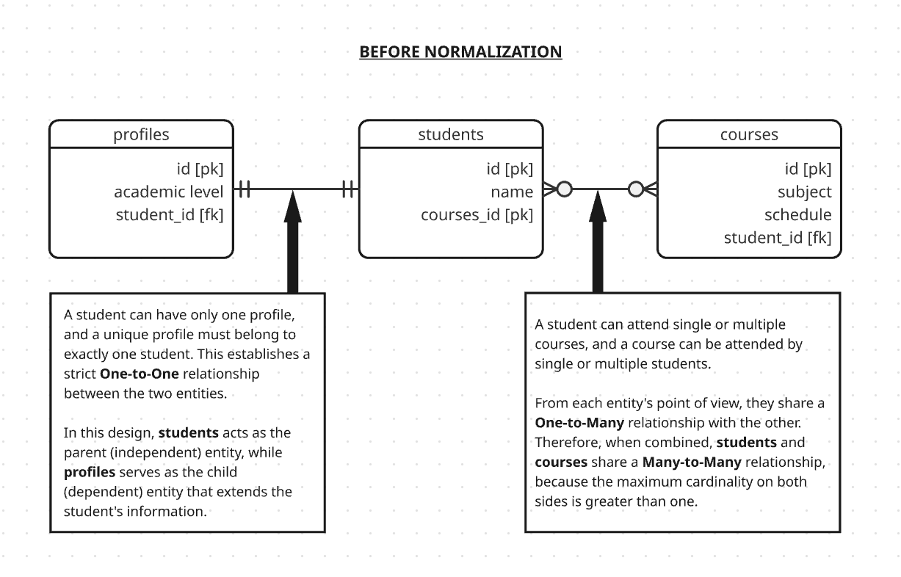
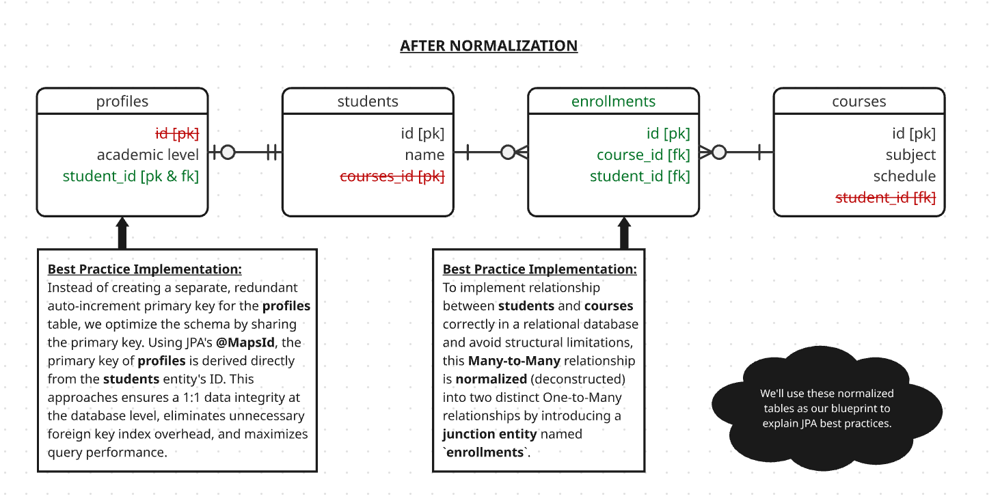

[← back to README](../README.md)

## 📖 Introduction: Understanding the Use-Case Schema
To truly grasp JPA best practices, we must look at how object models translate into clean database structures. In this cheatsheet, we use a standard academic domain consisting of Students, Profiles, and Courses to demonstrate how a poorly designed schema can be refactored into a high-performance relational database.

In the initial model, our domain attempts to capture a standard academic workflow where a central `students` entity sits between its personal records and academic activities. Logically, each student is assigned a single, dedicated record in the `profiles` table to store extension data like academic levels. Simultaneously, these students interact with the `courses` catalog, creating a dynamic environment where a single student can attend multiple classes, and a single course can be filled by multiple students.

While this accurately reflects the conceptual business logic of a school, translating this three-way web of interactions directly into physical database columns without proper structure creates severe design conflicts, as the tables try to reference each other simultaneously without a clear owner or a proper junction bridge.

In the initial design, the schema suffers from classic relational and JPA anti-patterns:
* **Redundant Indexes in 1:1 Relation:** The `profiles` table manages its own auto-increment `id` alongside a separate `student_id [fk]`, forcing the database to maintain two separate indexes for a strict 1:1 relationship.
* **The Impossible Many-to-Many Direct Link:** The `students` and `courses` tables attempt to link directly to one another by placing foreign keys (`courses_id` and `student_id`) inside the main entity tables. In a real-world relational database, this setup breaks down completely, as a single table column cannot natively store multiple records without breaking first normal form (1NF) rules.

---

To fix these architectural flaws, the schema undergoes a complete normalization process to separate responsibilities and optimize entity lifecycles:
1. **Shared Primary Key Optimization (`profiles` ↔ `students`):** We eliminate the redundant profile ID. By utilizing JPA’s `@MapsId`, the `student_id` in the `profiles` table now acts as both the Primary Key and the Foreign Key. The child table completely derives its identity from the parent, cutting index overhead by 50% and ensuring perfect 1:1 data integrity.
2. **Deconstructing Many-to-Many (`students` ↔ `courses` via `enrollments`):** We break down the direct Many-to-Many link by introducing a dedicated junction entity named `enrollments`. This deconstructs the complex association into two clean, predictable One-to-Many relationships. This junction table effectively isolates the relationship records, giving us full control over the database schema and preventing query anomalies.

💡 Note: We will use these normalized tables as our primary blueprint throughout this cheatsheet to explain optimized JPA mapping and query practices in Quarkus.

---

> 📝 Architectural Note on One-to-One Separation between **students** and **profiles**:
>
> In a production environment, you should **not** split a One-to-One relation into two separate tables ( `students` and `profiles`) unless you absolutely have to. If a student only has an address and a level, keeping them in a single `students` table is simpler and faster.
>
> We purposely separate them in this repository **for demonstration purposes** to show how to implement a clean One-to-One mapping using `@MapsId`. 
>
> In real-world apps, you only apply this separation for _Vertical Partitioning_, for instance, when the profile table holds heavy data (like large text blobs or binary data) and you want to keep the main `students` table lightweight and lightning-fast for frequent index scans.

